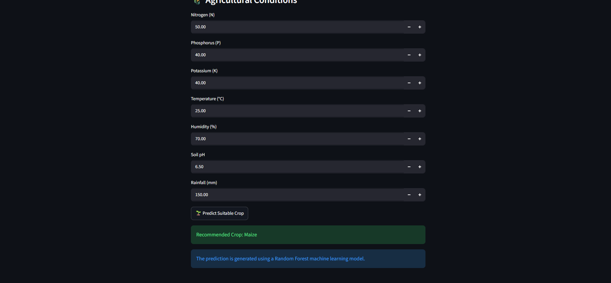

# 🌱 Agribot – Crop Prediction System

Agribot is a machine learning-based crop prediction and recommendation system built using Python and Streamlit. It analyzes soil and environmental conditions to recommend a suitable crop.

## 🚀 Features

- 🌱 Crop prediction using machine learning
- 🤖 Random Forest classification model
- 🌾 Uses soil and environmental parameters
- 📊 Interactive Streamlit web interface
- 💡 Data-driven crop recommendation

## 🛠️ Technologies Used

- Python
- Streamlit
- Pandas
- Scikit-learn
- Machine Learning

## 📋 Input Parameters

The application uses the following agricultural parameters:

- Nitrogen (N)
- Phosphorus (P)
- Potassium (K)
- Temperature
- Humidity
- Soil pH
- Rainfall

## 📸 Application Preview

The Agribot application provides an interactive interface where users can enter agricultural conditions and receive a recommended crop.

## ⚙️ Installation

Clone the repository:

```bash
git clone https://github.com/snehab0603/crop-prediction-agribot.git
